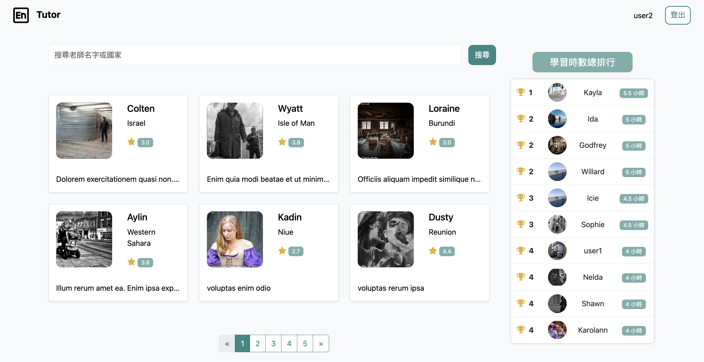

# Online Tutor Platform


## 介紹
線上家教平台，使用者可註冊成為學生，選擇老師預約課程，也可以成為老師開課。

### 功能
* 註冊預設為學生身份，可選擇老師開放的課程選課。
* 使用者可以填寫「成為老師」表單，轉換成為老師身份，可自行選擇開放預約的時間及課程時長。
* 學生可以修改個人資料，包含名字、國家、自我介紹。
* 學生可以取消預約的課程，或是對已上過的課程進行評價。
* 學生可以在個人頁面看到預約的課程、已上過的課程（已評價及未評價）、上課時數累積及排名。
* 老師可以在個人頁面看到已被預約的課程、學生的評價。
* 使用者可以在首頁看到老師列表、可以用關鍵字（老師名字或國家）搜尋、學生的學習時數排行榜。
* 管理者可以在後台看到使用者列表、學生列表、老師列表，並且可以看到使用者個別詳細資料。
* 管理者可以在後台透過關鍵字搜尋。

## 開始使用
1. 請先確認有安裝 node.js 與 npm
2. 將專案 clone 到本地
3. 在本地開啟之後進入資料夾，輸入：
  ```
  npm install
  ```
4. 連接資料庫後，輸入：
  ```
  npx sequelize db:migrate
  npx sequelize db:seed:all
  ```
5. 啟動 nodemon
  ```
  npm run dev
  ```
6. 若看見此行訊息則代表順利運行，打開瀏覽器進入到以下網址
  ```
  App is listening on port http://localhost:3000/
  ```
7. 若欲暫停使用，請輸入
  ```
  ctrl + c
  ```

### 測試帳號
+ 管理者
  - 帳號: root@example.com
  - 密碼: 12345678
+ user1:
  - 身分: 學生
  - 帳號: user1@example.com
  - 密碼: 12345678 
+ user2:
  - 身分: 老師
  - 帳號: user2@example.com
  - 密碼: 12345678 
